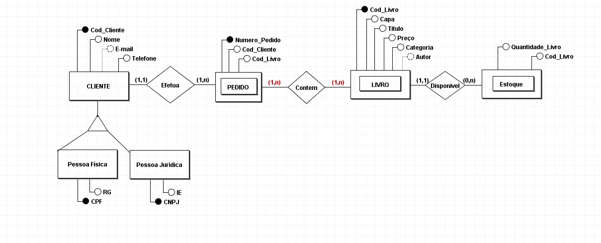
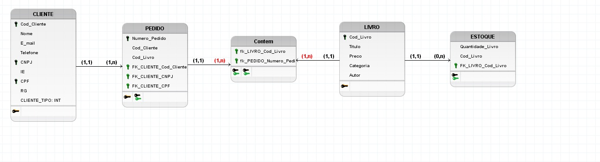

# 📚 Livraria API — Spring Boot

API REST desenvolvida em **Spring Boot** para gerenciamento de uma livraria.

---

## 📊 Diagramas do Projeto

### Diagrama do Sistema


### Modelo do Branco de Dados


---

## 🚀 Tecnologias

* Java
* Spring Boot
* Spring Data JPA
* Spring Security
* Lombok
* H2 Database

---

## 🔐 Autenticação

A API utiliza **Basic Auth**.

### Credenciais padrão:

```
Username: admin
Password: 123
```

### ⚠️ Importante:

* **GET** → público (não precisa login)
* **POST / PUT / DELETE** → requer autenticação

---

## 🗄️ Banco de Dados

Banco em memória **(H2)**

### Acesso ao console:

```
http://localhost:8080/h2-console
```

---

## 📦 Entidades

* Cliente
* Livro
* Pedido
* Contem (relacionamento Pedido ↔ Livro)
* Estoque

---

# 🔗 Endpoints

## 👤 Clientes

### GET

```
GET /clientes
GET /clientes/{id}
```

### POST

```
POST /clientes
```

**Content-Type:** application/json
```json
{
  "nome": "João",
  "email": "joao@email.com"
}
```

### PUT

```
PUT /clientes/{id}
```

### DELETE

```
DELETE /clientes/{id}
```

---

## 📖 Livros

### GET

```
GET /livros
GET /livros/{id}
GET /livros/capa/{id}
```

### POST

```
POST /livros
```

**Content-Type:** application/json
```json
{
  "titulo": "Java",
  "preco": 50.0
}
```

<br>

```
POST /livros/capa/{id}
```

**Content-Type:** multipart/form-data
| Chave | Valor|
|-------|------|
|Arquivo|Imagem|

### PUT

```
PUT /livros/{id}
```

### DELETE

```
DELETE /livros/{id}
```

---

## 🧾 Pedidos

### GET

```
GET /pedidos
GET /pedidos/{id}
```

### POST

```
POST /pedidos
```

**Content-Type:** application/json
```json
{
  "cliente": {
    "codCliente": 1
  }
}
```

### PUT

```
PUT /pedidos/{id}
```

### DELETE

```
DELETE /pedidos/{id}
```

---

## 🔗 Contem (Pedido ↔ Livro)

### GET

```
GET /contem
GET /contem/{id}
```

### POST

```
POST /contem
```

**Content-Type:** application/json
```json
{
  "pedido": {
    "numeroPedido": 1
  },
  "livro": {
    "codLivro": 1
  }
}
```

### PUT

```
PUT /contem/{id}
```

### DELETE

```
DELETE /contem/{id}
```

---

## 📦 Estoque

### GET

```
GET /estoque
GET /estoque/{id}
```

### POST

```
POST /estoque
```

**Content-Type:** application/json
```json
{
  "quantidadeLivro": 10,
  "livro": {
    "codLivro": 1
  }
}
```

### PUT

```
PUT /estoque/{id}
```

### DELETE

```
DELETE /estoque/{id}
```